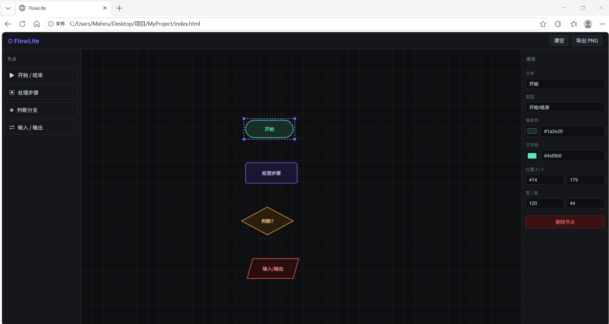

# FlowLite — 轻量级 Web 端流程建模工具

FlowLite 是一款基于 **HTML5 Canvas + 原生 JavaScript** 构建的可视化流程图编辑器，无需任何框架或构建工具，单文件即可运行。

---

## ✅ 已完成功能

### 阶段一：基础架构与画布搭建
- [✅] **项目初始化** — HTML/CSS/JS，无依赖，开箱即用
- [✅] **三栏布局** — 左侧工具栏 + 中间画布区 + 右侧属性面板
- [✅] **FlowCanvas 核心类** — 管理所有图形对象与交互状态
- [✅] **坐标系转换** — `screenToLogic()` / `logicToScreen()`，支持缩放与平移
- [✅] **requestAnimationFrame 渲染循环** — 流畅的实时重绘
- [✅] **BaseNode 抽象基类** — 统一定义 x/y/width/height/color/text/textColor

### 阶段二：图形绘制与交互
- [✅] **StartNode** — 圆角矩形，绿色描边（开始/结束节点）
- [✅] **ProcessNode** — 圆角矩形，紫色描边（处理步骤）
- [✅] **DecisionNode** — 菱形，橙色描边，含菱形精确 hitTest
- [✅] **IONode** — 平行四边形，红色描边（输入/输出）
- [✅] **居中文本绘制** — 自动换行适配节点尺寸
- [✅] **拖拽生成图形** — 从工具栏拖拽到画布实例化节点
- [✅] **图形选中与移动** — hitTest 碰撞检测 + 拖拽更新坐标
- [✅] **选中视觉反馈** — 紫色虚线边框 + 四角控制点
