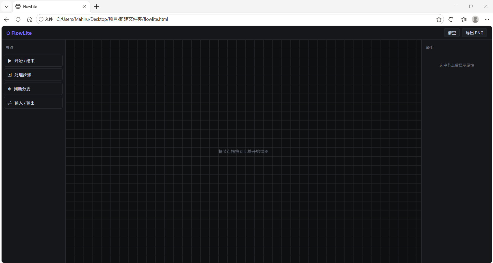
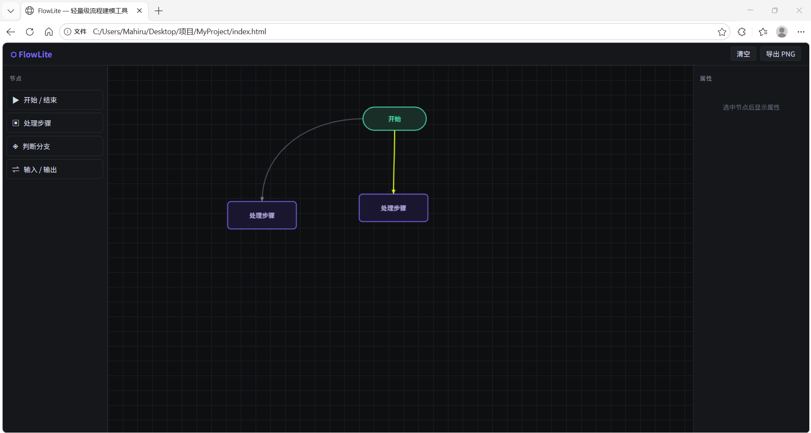
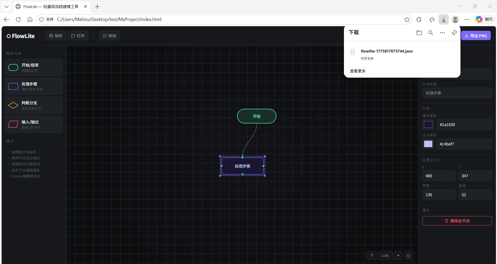
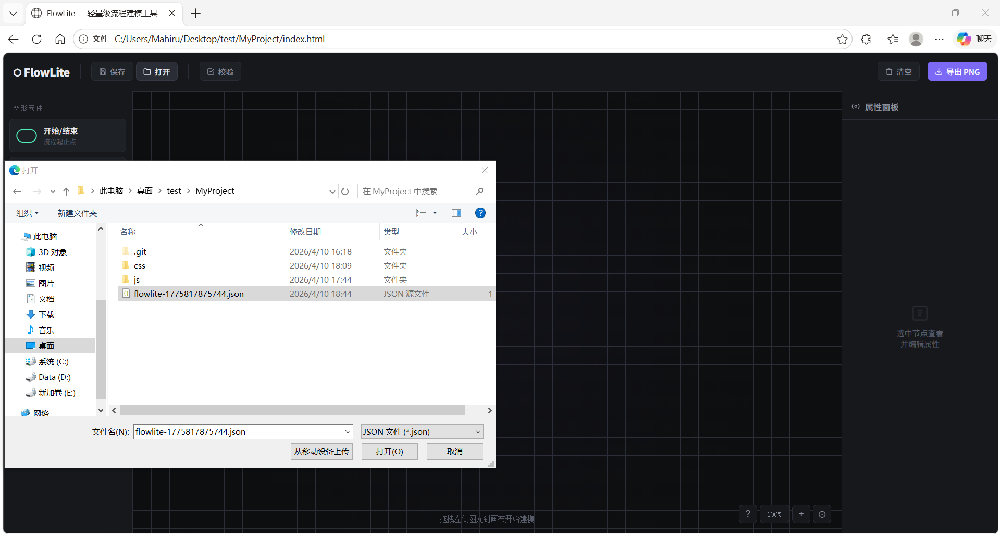
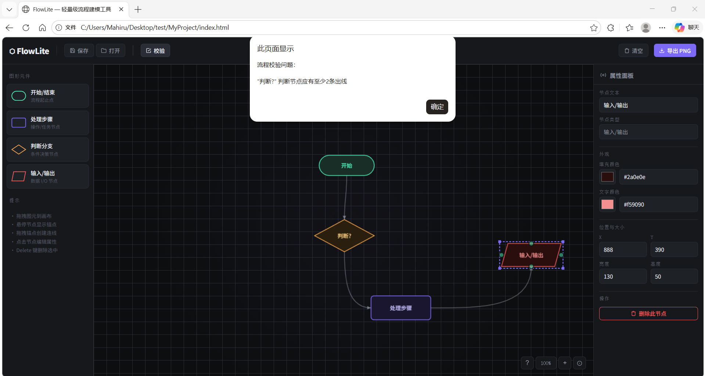
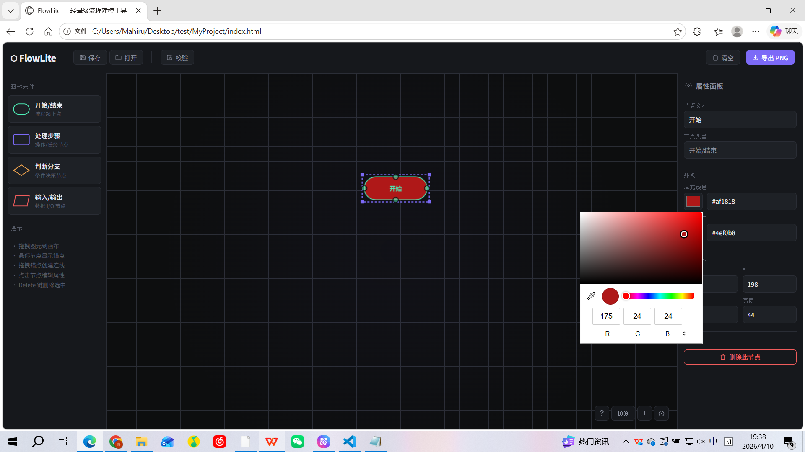
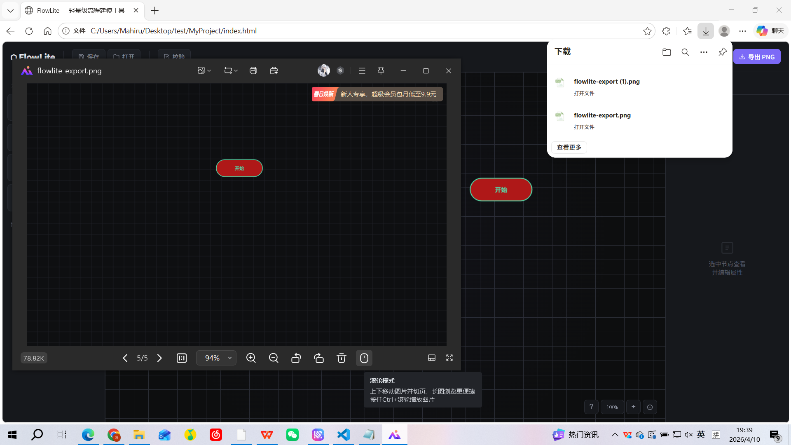

# FlowLite — 轻量级 Web 端流程建模工具

FlowLite 是一款基于 **HTML5 Canvas + 原生 JavaScript** 构建的可视化流程图编辑器，无需任何框架或构建工具，单文件即可运行。

---

## ✅ 已完成功能

### 阶段一：基础架构与画布搭建
- [✅] **项目初始化** — HTML/CSS/JS，无依赖，开箱即用
- [✅] **三栏布局** — 左侧工具栏 + 中间画布区 + 右侧属性面板
- [✅] **FlowCanvas 核心类** — 管理所有图形对象与交互状态
- [✅] **坐标系转换** — `screenToLogic()` / `logicToScreen()`，支持缩放与平移
- [✅] **requestAnimationFrame 渲染循环** — 流畅的实时重绘
- [✅] **BaseNode 抽象基类** — 统一定义 x/y/width/height/color/text/textColor

### 阶段二：图形绘制与交互
- [✅] **StartNode** — 圆角矩形，绿色描边（开始/结束节点）
- [✅] **ProcessNode** — 圆角矩形，紫色描边（处理步骤）
- [✅] **DecisionNode** — 菱形，橙色描边，含菱形精确 hitTest
- [✅] **IONode** — 平行四边形，红色描边（输入/输出）
- [✅] **居中文本绘制** — 自动换行适配节点尺寸
- [✅] **拖拽生成图形** — 从工具栏拖拽到画布实例化节点
- [✅] **图形选中与移动** — hitTest 碰撞检测 + 拖拽更新坐标
- [✅] **选中视觉反馈** — 紫色虚线边框 + 四角控制点

### 阶段三：连线与拓扑关系
- [✅] **四向锚点系统** — Top/Bottom/Left/Right，选中时显示绿色锚点
- [✅] **Connection 类** — 记录 sourceNodeId/sourceAnchor/targetNodeId/targetAnchor
- [✅] **贝塞尔曲线连线** — 带方向感知的控制点，自适应曲率
- [✅] **箭头渲染** — 沿贝塞尔切线方向的填充箭头
- [✅] **拖拽锚点创建连线** — 临时虚线随鼠标跟随，释放到目标锚点正式建立连接
- [✅] **动态连线更新** — 节点移动时连线端点实时跟随
- [✅] **连线选中与删除** — 点击连线高亮（紫色），Delete 键删除

### 阶段四：数据存储与文件操作
- [✅] **JSON 序列化** — nodes 数组 + edges 数组的标准结构
- [✅] **保存 JSON** — 触发浏览器下载 `.json` 文件
- [✅] **打开 JSON** — 读取本地文件，工厂方法重建所有节点与连线

### 阶段五：逻辑校验与完善
- [✅] **属性编辑面板** — 实时编辑文本、填充色、文字色、位置、尺寸
- [✅] **流程合法性校验** — 检测孤立节点、判断节点出度不足、开始节点有入线
- [✅] **导出 PNG** — `canvas.toDataURL()` 含背景与网格，触发下载

---

## 🚀 运行环境

| 项目 | 要求 |
|------|------|
| 运行环境 | 任意现代浏览器（Chrome 105+、Firefox 102+、Safari 15+、Edge 105+） |
| 依赖 | **无**（零外部依赖） |
| 构建工具 | 无需构建 |
| 字体 | Google Fonts（需联网；断网时回退系统字体） |

---

## 📦 快速开始

---bash
# 克隆或下载项目
git clone <repo>
cd flowlite

# 直接用浏览器打开（推荐）
open index.html

> **无需 npm install**，单个 `index.html` 文件包含全部逻辑。

## 💾 JSON 数据格式

保存的 `.json` 文件结构如下：

---json
{
  "nodes": [
    {
      "id": "w4xw1pqz",
      "type": "StartNode",
      "x": 165,
      "y": 124,
      "width": 120,
      "height": 44,
      "text": "开始",
      "color": "#1a2e28",
      "textColor": "#4ef0b8"
    },
    {
      "id": "k4607eaz",
      "type": "ProcessNode",
      "x": 162,
      "y": 269,
      "width": 130,
      "height": 52,
      "text": "处理步骤",
      "color": "#1a1630",
      "textColor": "#c4bef7"
    }
  ],
  "edges": [
    {
      "id": "xos4y4pm",
      "sourceNodeId": "w4xw1pqz",
      "sourceAnchor": "bottom",
      "targetNodeId": "k4607eaz",
      "targetAnchor": "top",
      "label": ""
    }
  ]
}